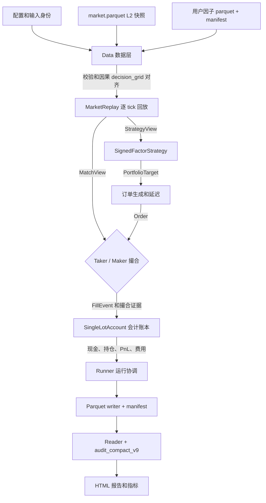

# Backtrade v0.1.0 架构

本文描述 v0.1.0 的用户有符号因子回测主链路；`l1_imbalance` 是内置示例。
模型限定为单品种、单手、无保证金和无组合持仓。

## 1. 分层概览

| 层 | 主要模块 | 输入 | 输出 |
| --- | --- | --- | --- |
| Data 数据 | `data.future_l2`、`data.market_quality`、`data.limit_reference`、`data.replay` | L2 快照、用户因子、配置 | 校验输入身份，完成因果对齐，整理 `MarketTick` |
| Strategy 策略 | `strategies.signed_factor.SignedFactorStrategy` | 已完成的有符号因子和当前仓位 | 输出 `PortfolioTarget` |
| Order / Matching 订单与撮合 | `simulation.execution`、`order_match.taker`、`order_match.maker` | 目标仓位、延迟、盘口视图 | 输出订单状态、成交和撮合证据 |
| Simulation 模拟交易 | `simulation.compact_v9_runner`、`simulation.events` | tick、目标、订单、成交 | 驱动生命周期、边界和序号 |
| Accounting 会计账本 | `position.single_lot.SingleLotAccount` | 成交、费用、合约规则 | 更新持仓、现金、权益和 PnL |
| Output / Audit 产物与审计 | `simulation.compact_v9`、`runtime`、`reporting` | 运行状态和输入身份 | Parquet、manifest、审计结果和 HTML |

## 2. 主数据流

`CompactV9Runner` 在每个 tick 上协调回放、策略、订单、撮合和会计更新。

## 3. Data 和因子对齐

市场快照可以直接配套用户计算的有符号因子；因子名由 YAML 的
`strategy.factor_name` 和 `strategy.factor_column` 共同指定，运行链路不固定为
`l1_imbalance`。内置 `l1_imbalance` 也可以由 CLI 从买一和卖一数量生成。
生成后的因子文件仍然作为独立输入，并由 manifest 绑定市场哈希和因子哈希。

Data 层只执行因果 `decision_grid` backward as-of join：

- 因子源 tick 与行情 tick 时间相等时，设置 `factor_decision=true`；
- 中间行情只携带最近的已完成因子；
- 任何未来因子都不能参与当前决策；
- 完整流 EOF 可以声明为已知日末；抽样 EOF 只能是 `end_of_data`。

## 4. 策略和订单

`signed_factor_v1` 将配置的有符号因子映射为目标仓位：

- 正值：目标为一手多头；
- 负值：目标为一手空头；
- 零值：保持当前仓位；
- 反向：先输出平仓目标，再输出反向开仓目标。

订单包含决策时间、到达时间、方向、数量、目标序号和因子元数据。
撮合层不重新解释策略信号。

## 5. Taker 和 Maker

Taker 在订单到达 tick 使用对手 L1 成交。
Maker 使用 MBP expected-queue 估计，不声称交易所 FIFO 重建。

Maker 的关键规则：

- 等价价先消耗 queue_ahead；
- 只有严格穿过挂单价才允许 trade-through；
- stale、anomaly、side-ambiguous 行情不推进队列；
- 初次不在 L1 或会立即吃单时 rejected；
- 已排队后离开 L1 时 cancel。

两种模式共用 Data、Strategy、Simulation、Accounting 和 Output 契约。

## 6. 会计和产物

每个成交只产生一次会计事件：

- 开仓：`net_pnl = -open_fee`；
- 平仓：`net_pnl = gross_pnl - close_fee`。

审计要求现金、累计 PnL、手续费和最终空仓守恒。
manifest 记录输入身份、配置摘要、代码来源、EOF 边界、延迟、撮合模式和最终文件哈希。
启用价格限制时，Data 层还会校验参考快照是否覆盖实际交易日和合约；
`prev_day_vwap_proxy` 是近似参考，不等同于官方结算价。
当前版本不支持多手、保证金、组合持仓、官方结算价或交易所 FIFO。
