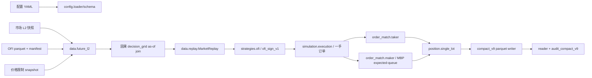

# Backtrade compact_v9 架构与信息流

本文只描述当前真实路径。synthetic、full-tick、外部方向过滤和旧
compact_v6/v8 分支不属于当前契约。

## 1. 主流程



## 2. 数据与时间边界

`future_l2` 先校验因子 manifest 版本、唯一因子列、parquet 哈希、连接键和
选择范围，再按 product、trading_day、session、underlying contract 做
backward as-of join。只有源时间与行情时间精确相等时才产生
`factor_decision=true`，其他行情只携带旧因子，不能前视。

`MarketReplay` 检查单品种时间/源序号、交易日和换月顺序，并提供
`StrategyView` 与 `MatchView`。完整无界流只有显式
`eof_is_day_end=true` 才把 EOF 作为已知日末；有 `max-events` 或
`max_ticks` 时 EOF 是 `end_of_data`。换月与日末重合只保留一次
`contract_roll_flatten`。

## 3. 信号、订单、撮合

` OFISignStrategy` 固定实现 `ofi_sign_v1`：正值为 +1，负值为 -1，零值保持；
反向目标先输出 reduce-only 平仓。`ExecutionEngine` 负责延迟和一手订单。
Taker 使用到达行情的对手 L1；Maker 挂在决策时同侧 L1。

`MakerMatcher` 是 MBP expected-queue 估计器，manifest 明确
`FIFO_reconstruction=false`。同价成交先扣 `queue_ahead`，只有队列达到零
才 fill；strict trade-through 需要高置信度反向成交且价格严格穿过挂单。坏
行情重新建立可见深度但不推进队列；首次离开 L1 或会 cross quote 的订单拒绝，
排队后离开 L1 的订单撤单。它不声称重建交易所 FIFO。

## 4. 生命周期与账务

runner 独占 target/order/fill 序号和账务写入。边界先撤销活动单，持仓存在时
用无延迟 taker 强平；EOF 残余持仓使用 `end_of_data_flatten`。账户每个品种
只保留一个开仓仓位，按合约乘数计算毛利并选择 `close_today` 或 `close`
费用。每行 `net_pnl` 是该 fill 的现金变化，必须满足：

```text
sum(account.net_pnl) = final_cash - initial_cash
sum(account.net_pnl) = realized_pnl - total_fee
```

## 5. manifest 与审计

writer 关闭 parquet 后才计算最终文件哈希。manifest 包含固定文件清单、config
digest、实际 market/factor/factor manifest/价格限制/合约文件身份、Git revision
和 dirty 状态、核心源码哈希、latency、EOF 边界及 maker 声明。reader 验证物理
schema、文件清单/哈希、config digest 和输入身份；`audit_compact_v9` 再检查
目标语义、延迟、taker L1、maker 严格证据、fill/account 一对一、现金/PnL
守恒和最终 flat。

## 6. 范围

适用场景是：一个人拿到符合契约的 L2 快照、canonical OFI 因子和配置后复现
单品种单手回测。不重建 FIFO，不提供官方结算价，不模拟多手、保证金或组合
持仓；`prev_day_vwap_proxy` 只是显式近似。